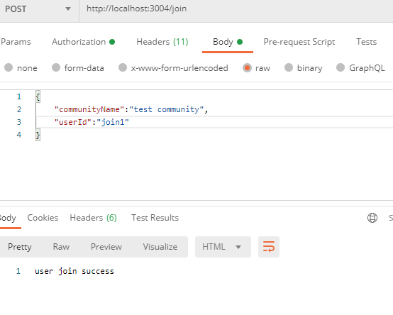
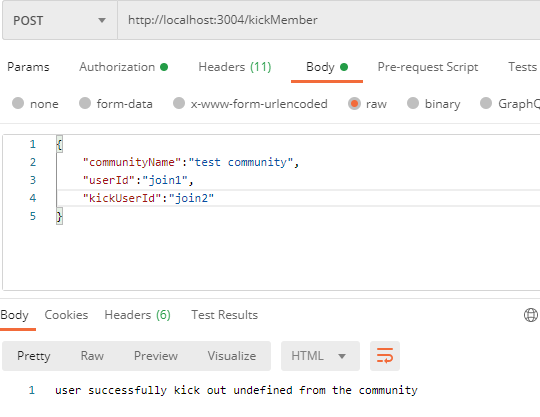
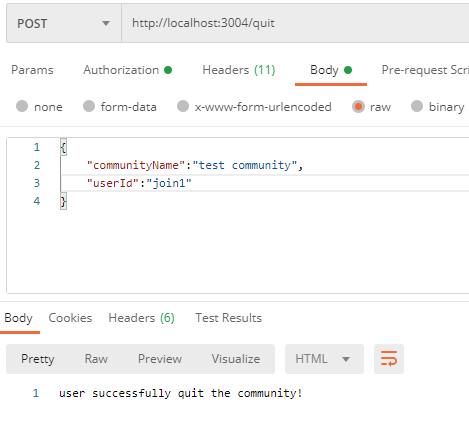
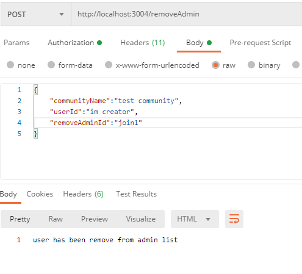
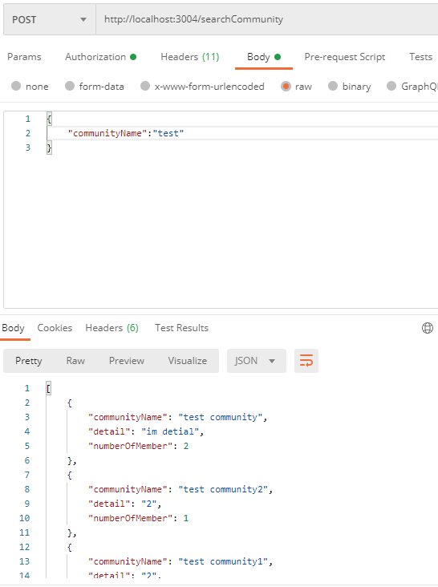
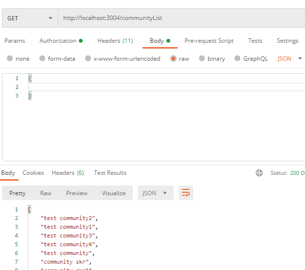
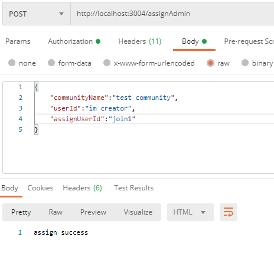
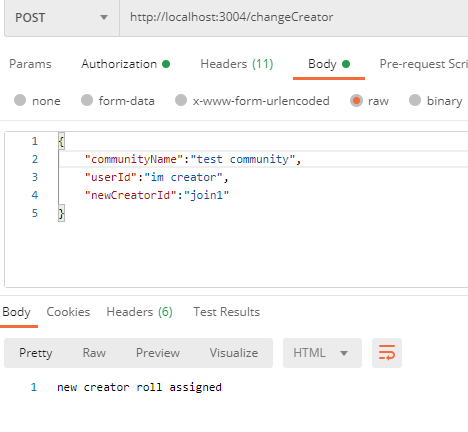
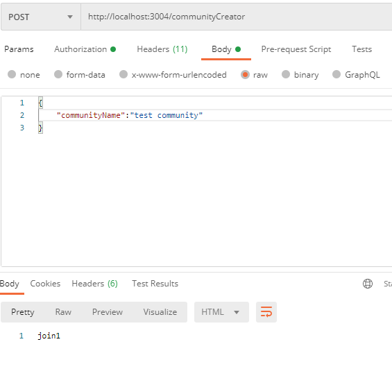
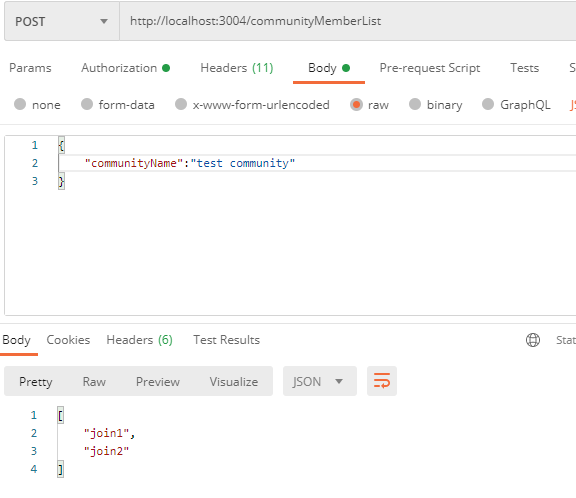

# APower
Community Service

## description 
Community service manages all community data and handle incoming http request

## Setup 
You need the latest stable versions of these programs:

    * MongoDB
    * npm
    * node

## Instructions
Open up a terminal in the root directory of the project and type this in to install the dependencies locally.

```bash
npm install
```

Now in the same directory type this in to launch the server:

```bash
node server.js
```

Now, open up a web browser and enter http://localhost:3000 in the URL bar.

## Example

* /create


* /join



* /invite


* /kickMember



* /quit



* /removeAdmin



* /searchCommunity



* /communityList



* /assignAdmin



* /changeCreator



* /communityAdminList


* /creator



* /communityMemberList

