# APower
gamePlay Service

## description 
game play service manages all gmaePlayService manages all chat rooms

## Setup 
You need the latest stable versions of these programs:

    * MongoDB
    * npm
    * node

## Instructions
Open up a terminal in the root directory of the project and type this in to install the dependencies locally.

```bash
npm install
```

Now in the same directory type this in to launch the server:

```bash
node server.js
```

Now, open up a web browser and enter http://localhost:3000 in the URL bar.

## Example

* /createGameRoom

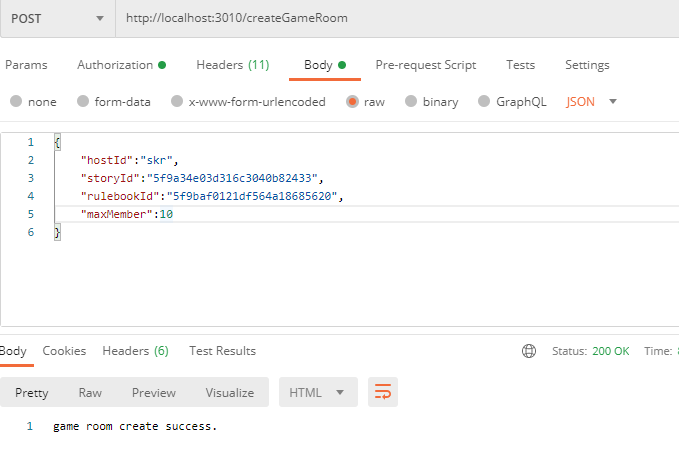

* /deleteGameRoom

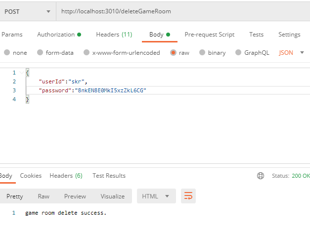

* /getRoomByPlayerId

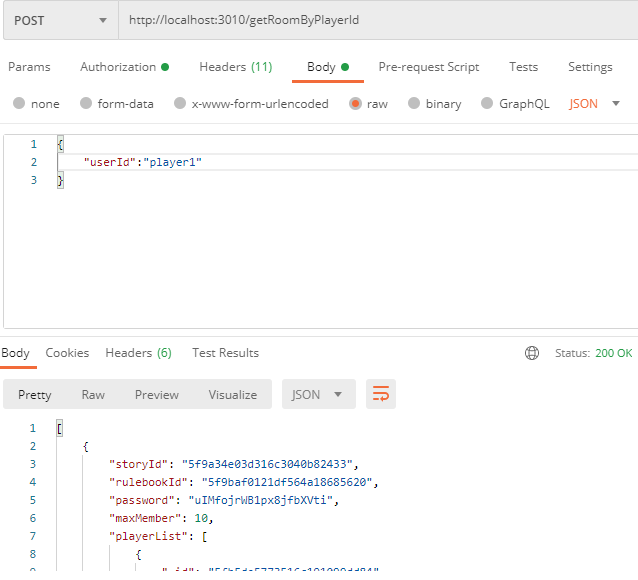

* /getRoomByHostId

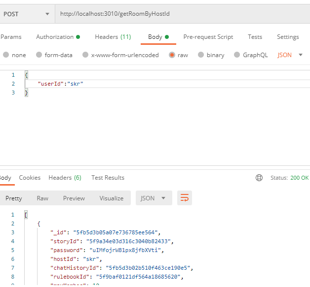

* /invitePlayer

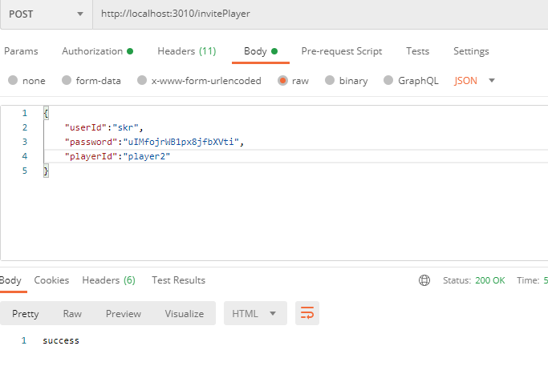

* /kickPlayer

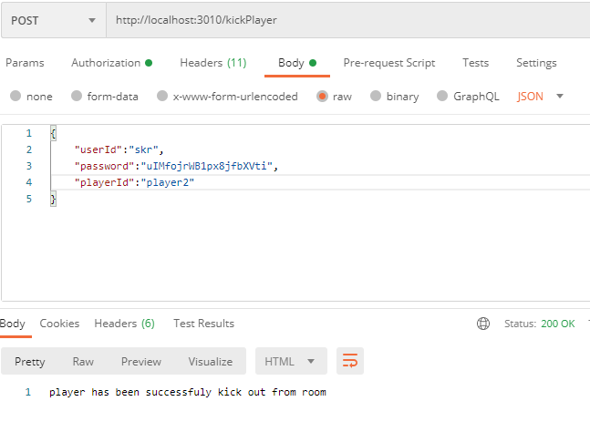

* /quit

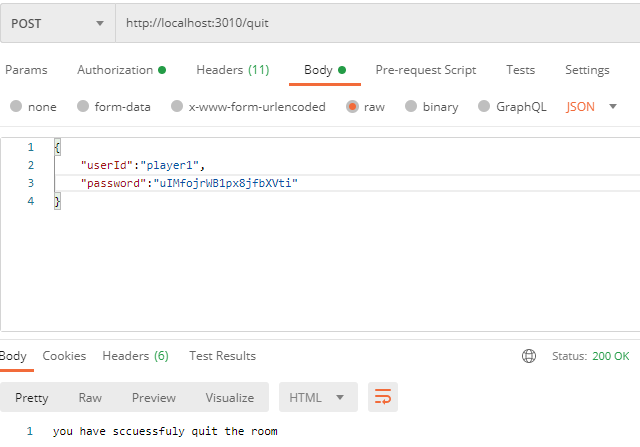

* /assignHost


* /roomMember

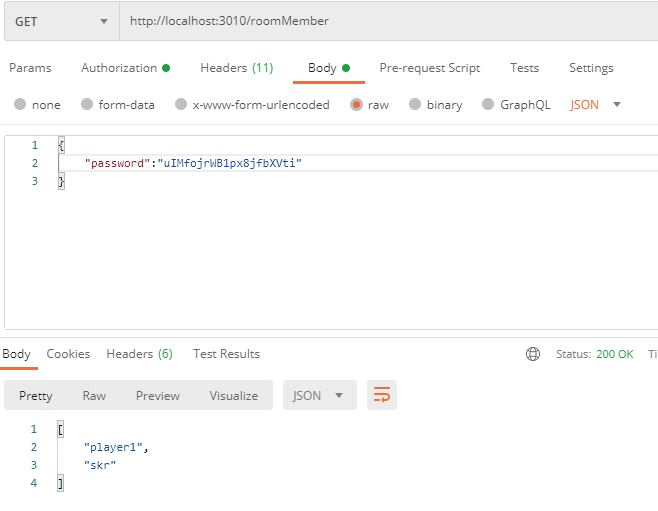

* /changeCharId

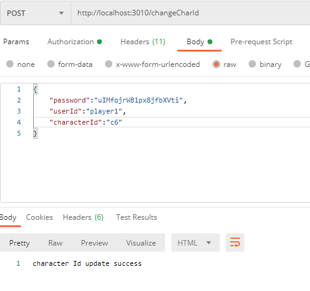

* /story

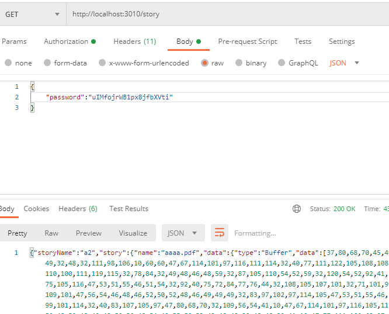

* /characterById

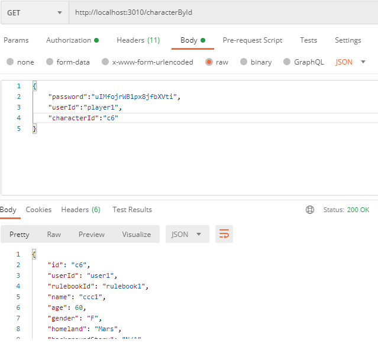

* /skill

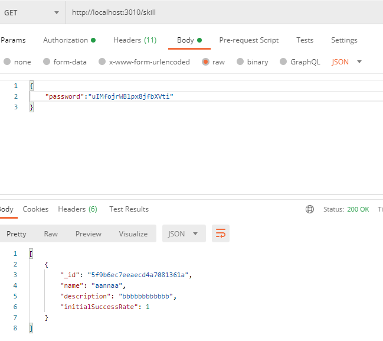