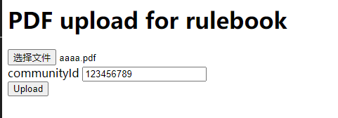
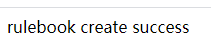
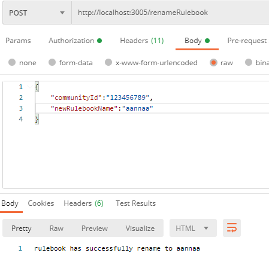
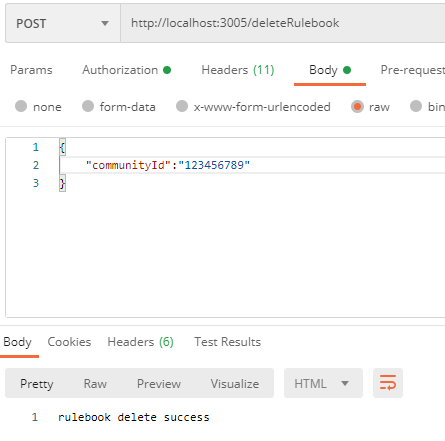
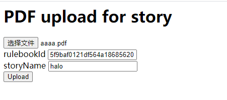
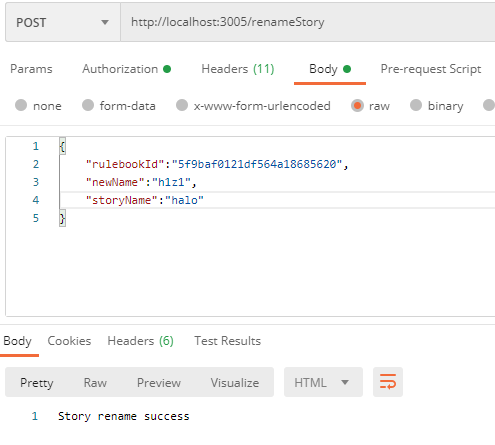
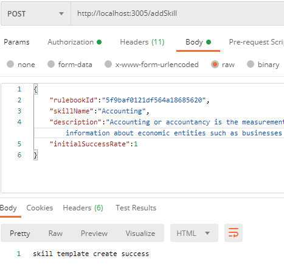
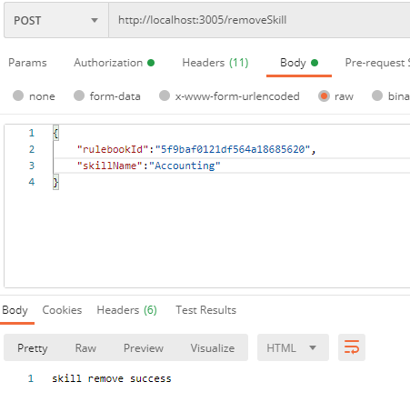
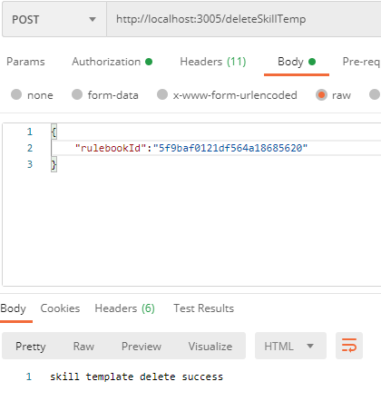

# APower
Rulebook Service

## description 
Rulebook service manages all rulebook,stories,skills creation and access, and handle incoming http request

## Setup 
You need the latest stable versions of these programs:

    * MongoDB
    * npm
    * node

## Instructions
Open up a terminal in the root directory of the project and type this in to install the dependencies locally.

```bash
npm install
```

Now in the same directory type this in to launch the server:

```bash
node server.js
```

Now, open up a web browser and enter http://localhost:3005 in the URL bar.

## Example
* /create




* /renameRulebook



* /deleteRulebook



* /uploadStory




* /removeStory


* /renameStory



* /addSkill



* /removeSkill



* /deleteSkillTemp

